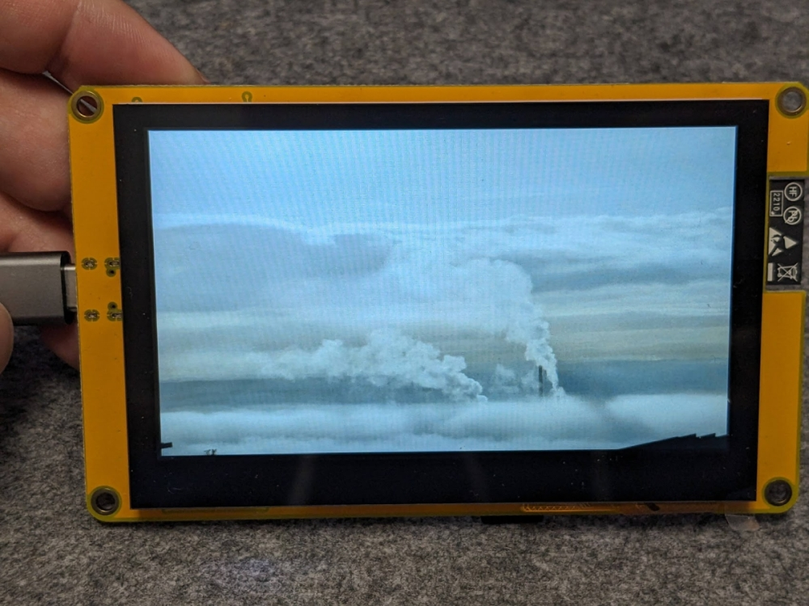

# ESP32-8048S043 picture frame
The program turns the ESP32-8048S043 into a digital picture frame. It displays all JPG files from the SD card.

Image changes every 10 seconds or after pressing the boot button. Also support touch screen control.

